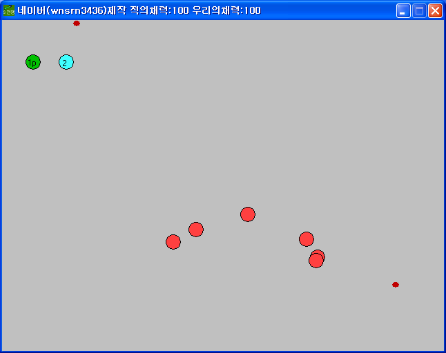

# S전쟁

키보드 하나로 두 명이 붙어 앉아 플레이하는 2인 협동 슈팅이다.

  

## 플레이 방법

Releases에서 받아 실행하면 된다.

| | 이동 | 스킬 |
|---|---|---|
| 1P | 방향키 | J, L |
| 2P | WASD | T, U |

적에게 다가가면 총알이 자동으로 나간다. 스킬 키로 방어막을 치거나 이동속도를 올릴 수 있고, 200스텝 뒤에 풀린다. Z와 X는 저장과 불러오기, P는 다시 시작이다. 스테이지는 3탄까지 있다.

체력은 두 플레이어가 하나를 같이 쓰고 창 제목표시줄에 "우리의채력"으로 나온다. 스킬을 쓰면 이 체력이 깎이는데, 이동속도가 30, 방어막이 20이다. 체력이 0이 되면 P로 다시 시작한다.

## 구현 원리

체력은 게임메이커 내장 `lives` 값 하나로 관리한다. 그래서 두 플레이어가 한 체력을 공유하고, 스킬 비용도 같은 값에서 빠진다.

적 감지에는 커뮤니티에서 받은 액션 라이브러리를 썼다. 일정 거리 안이면 무조건 감지하고 그보다 먼 거리는 바라보는 방향 기준으로 시야각 안에 들어올 때만 감지하는 판정이다. 이 게임은 두 거리를 90으로 같게 두어 거리 판정으로만 감지한다. 이 라이브러리를 설치해야 게임메이커에서 프로젝트가 열린다.

## 파일

| 경로 | 내용 |
|---|---|
| `source/s-war.gmk` | 원본 프로젝트 파일 |
| `source/lib/AI.lib` | 적 감지에 쓴 액션 라이브러리. 게임메이커의 `lib` 폴더에 넣어야 프로젝트가 열린다 |
| `source/split/` | GmkSplitter로 분해한 텍스트 트리 |
| `docs/screenshots/` | 스크린샷 |
| Releases | 배포용 파일 |

## 크레딧

`source/lib/AI.lib` 은 멍멍이(qw5628)님이 만든 액션 라이브러리다.

## 라이선스

CC BY-NC-ND 4.0 라이선스다. 출처를 밝히면 비상업 용도로 그대로 공유할 수 있고, 수정본 배포와 상업적 이용은 금지한다. 함께 들어 있는 것 중 다른 사람이 만든 라이브러리와 그림·소리·맵은 각자의 권리를 따른다. 자세한 내용은 [LICENSE](LICENSE) 에 있다.
